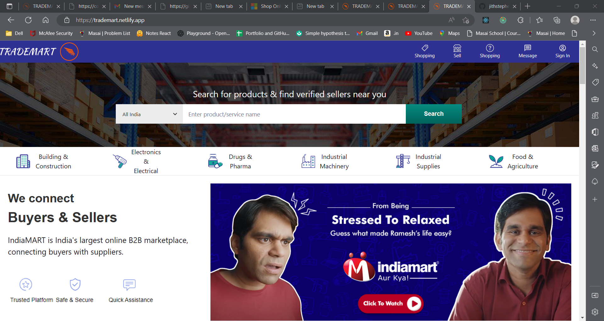
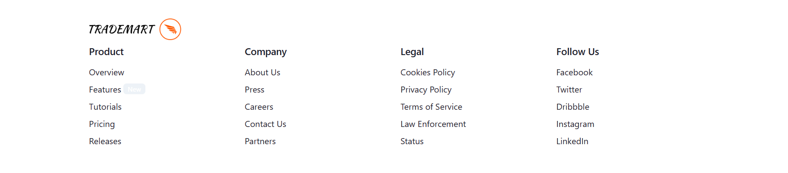
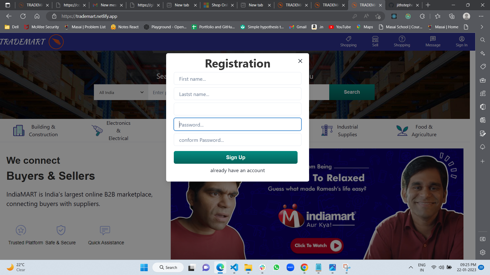
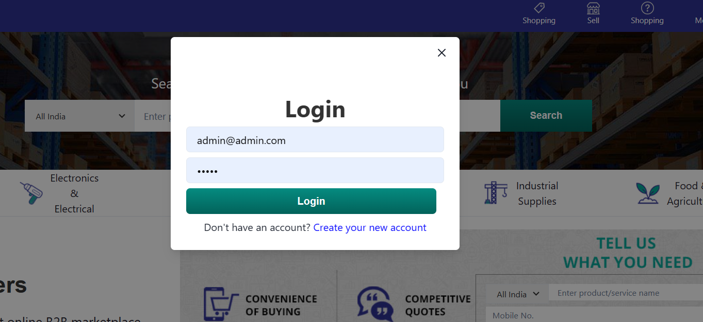
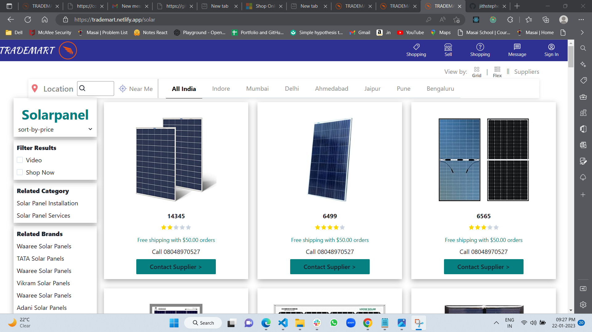
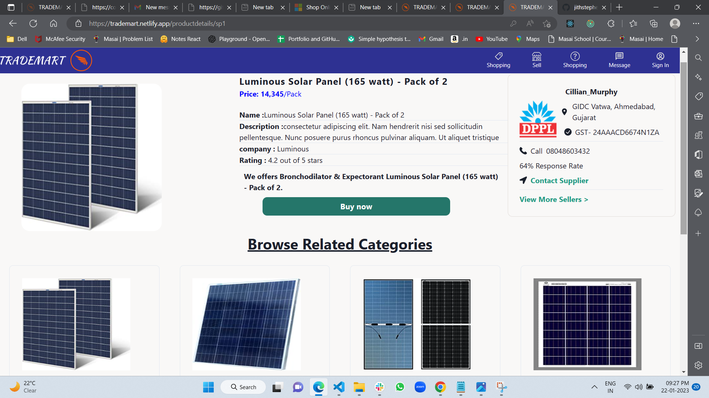
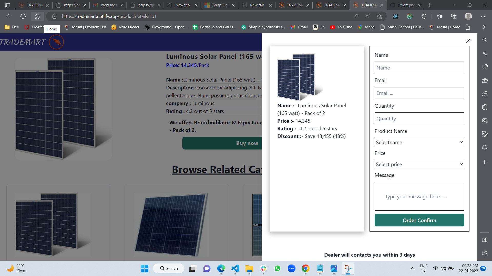

# TRADEMART

 

##  Contributors 
 Jith Stephen.
 
 swarup kadoli.
 
 swati sucharita mohanty.
 
 Shivam Kumar.
 
 
##  Steps to follow
git clone 

npm i

# Project TredeMart 

Hello everyone, this is a Readme for our construct week project that has been completed successfully within the duration of 5 days. It was really greate experience for us. Below  described the Features of our project.

 

### Deployed Links:
- https://trademart.netlify.app/
 
 

## Project Details:

We got given a task to make a functional clone website of IndiaMart. IndiaMart Indian e-commerce company that provides B2B and customer to customer sales services via its web portal. The website some pages such as Login, signup, Landing-page, product,product detailes ,admin etc.we tried my best to clone the website from scratch based on the knowledge gained till unit-5 of Journey at Masai School.

So we are tried to connect  our user and deler through email ,Means if our user is intrested in purchase any product they can put an enquery, delere will get that enquery throgh a mail also it will updated on Admin Side also 

- Original LOGO :
        
- Our LOGO :
   
 

## Tech-Stack:

- React.js
- React Routing
- React Redux
- React Redux Thunk
- CSS
- HTML
- Chakra UI Library
- Firebase

Glimpse and Screenshots of our cloned website:

## Navbar:

- This is the landing page of our website. Clicking an option on the Navbar will redirect to the respective page.

- 

## Home Page:

- The images on the home page are linked to all Pages. Hence clicking on it will ensure successful redirection to the next Page.

- 

## Footer bar:
- Here we have functions such as Indiamart official social media link, contacts, policies, and information. account, and address.

 
- 

## Signup:

- Here we have a Modal Function on any page when users click on signup they get a popup on the screen  .
- User can Create account ny filling Signup Form
- 
 

## Login page:

- Here we have a Modal Function on any page when users click on Login they get a popup on the screen. If the user is registered with the website, only then he/she can log in with their respective email id & password.
- User can Login with regestered email ID
- 
 

## Product Page:

## Pdoduct Detailes Page:

 

## Admin:

- 

- Technically Help is the last page developed for the best User Interface UI smooth Operations.

